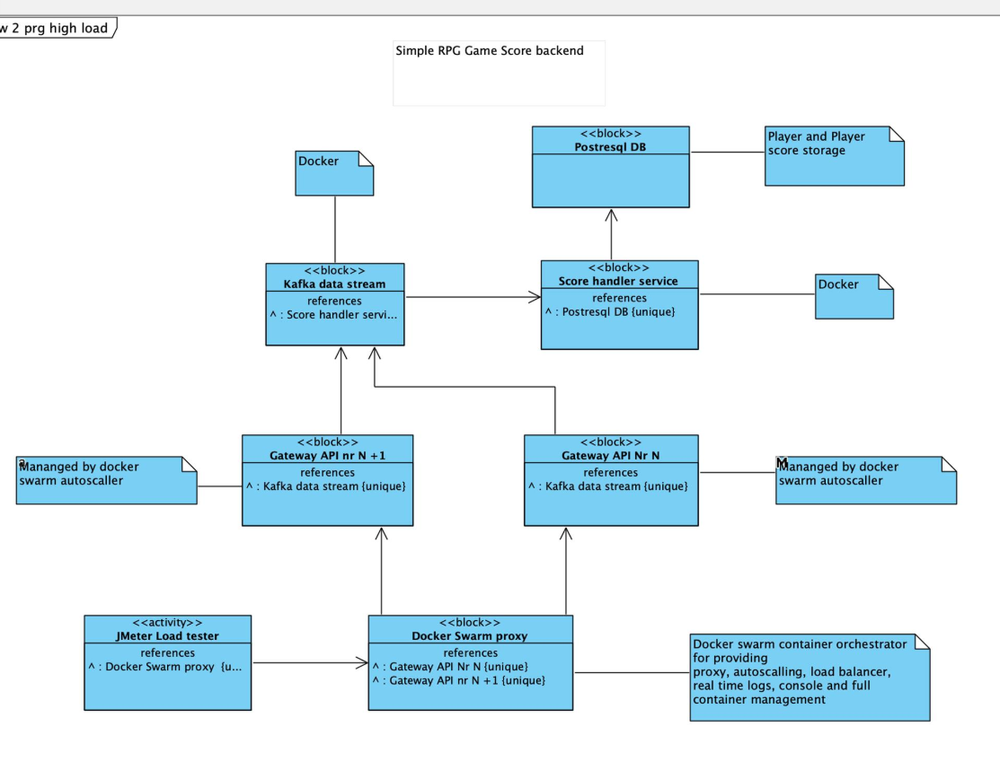

# distributed systems with load test

The main goal is to create project which represents a minimalistic microservice
architecture. This project is based on Java/Kotlin and gradle.

Required tools: **Gradle** , **Kotlin/Java**, **npm**, **Kubernetes**, **Jmeter** 
and **Docker**.

### What this app can do
Send post requests to the kafka broker over the gateway api, when a load on 
a CPU is getting to high the kubernetes adds additional instance to balance 
a load between multiply instances. There is also a consumer which prints out all
messages he receives.

### Structure

## Build and run the infrastructure in the Docker :rocket:

`docker-compose up --build
`

## Check if containers are running
`curl --location --request POST 'localhost:8080/player' \  
--header 'Content-Type: application/json' \  
--data-raw '{ "playerId": 20, "score": 15, "timestamp": 1621016664 }'
`

